# Relatório de Análise: Impacto da Limpeza de Tabelas no Tempo de Reserva de Ondas

Este relatório apresenta uma análise detalhada dos logs das ondas **25013**, **25014** e **25015** (extraídos da pasta `Reserva apos alteração`) após a limpeza realizada em tabelas do banco de dados. Os resultados mostram um ganho de desempenho extraordinário em comparação com o comportamento histórico do sistema.

---

## 1. Resumo Executivo

> [!IMPORTANT]
> A limpeza de tabelas no banco de dados removeu o principal gargalo do sistema. A velocidade de processamento de reservas de ondas aumentou entre **3.3x e 4.7x**, com o tempo médio de processamento por ordem despencando de **~7.3 segundos** para **~1.6 - 2.0 segundos**.

- **Onda 25013 (142 ordens)**: Concluída em **4m 50s** (Previsto pelo modelo antigo: 16m 28s) → **70.6% mais rápida**.
- **Onda 25014 (447 ordens)**: Concluída em **12m 32s** (Previsto pelo modelo antigo: 58m 15s) → **78.5% mais rápida**.
- **Onda 25015 (186 ordens)**: Concluída em **5m 06s** (Previsto pelo modelo antigo: 21m 55s) → **76.7% mais rápida**.

---

## 2. Métricas Detalhadas das Novas Ondas

Abaixo estão os dados reais extraídos diretamente dos novos logs utilizando a janela estrita (tempo decorrido entre o início oficial da onda e a gravação da mensagem de conclusão):

| Métrica | Onda 25013 | Onda 25014 | Onda 25015 |
| :--- | :---: | :---: | :---: |
| **Data do Log** | 14/07/2026 | 15/07/2026 | 16/07/2026 |
| **Hora de Início** | 06:03:40.028 | 20:13:41.177 | 01:36:11.769 |
| **Hora de Término** | 06:08:30.407 | 20:26:12.918 | 01:41:17.725 |
| **Duração Real** | **4m 50s** (290.4s) | **12m 32s** (751.7s) | **5m 06s** (306.0s) |
| **Total de Ordens (N)** | **142** | **447** | **186** |
| Ordens Completas | 88 (62%) | 435 (97.3%) | 175 (94.1%) |
| Ordens Pendentes | 54 (38%) | 12 (2.7%) | 11 (5.9%) |
| **Total Reservas (Linhas)** | 733 | 1.254 | 477 |
| **Total Unidades Reservadas** | 145.362 | 222.126 | 103.491 |
| **Total Unid. Faltantes** | 57.756 | 6.293 | 2.438 |
| **Total PKLs Criados** | 125 | 443 | 181 |
| **Tempo Médio por Ordem** | **2.04 seg** | **1.68 seg** | **1.64 seg** |

---

## 3. Comparativo com o Modelo Antigo e Histórico

Antes da limpeza do banco de dados, o comportamento do tempo de reserva seguia a fórmula quadrática calibrada:
$$T_{antigo}(seg) = 0.00298499 \times N^2 + 6.463413 \times N + 9.7501$$

### Comparação de Tempo: Real vs. Modelo Antigo (Previsão)

```mermaid
gantt
    title Comparação de Tempo de Execução (Real vs Antigo)
    dateFormat  X
    axisFormat %s
    
    section Onda 25013 (142 ordens)
    Tempo Real (4m 50s) :active, 0, 290
    Previsto Antigo (16m 28s) : 0, 988
    
    section Onda 25014 (447 ordens)
    Tempo Real (12m 32s) :active, 0, 752
    Previsto Antigo (58m 15s) : 0, 3495
    
    section Onda 25015 (186 ordens)
    Tempo Real (5m 06s) :active, 0, 306
    Previsto Antigo (21m 55s) : 0, 1315
```

### Detalhamento das Diferenças

1. **Onda 25013 (N = 142)**:
   - *Previsto Antigo*: 987.7s (16m 28s)
   - *Real pós-limpeza*: **290.4s (4m 50s)**
   - **Ganho**: **-70.6% de tempo** (3.4x mais rápido)
   - *Comparativo Histórico*: A onda histórica **24619** (N = 129) levou 14m 40s. A nova onda, mesmo sendo maior (142 ordens), levou apenas 4m 50s!

2. **Onda 25014 (N = 447)**:
   - *Previsto Antigo*: 3.495.3s (58m 15s)
   - *Real pós-limpeza*: **751.7s (12m 32s)**
   - **Ganho**: **-78.5% de tempo** (4.6x mais rápido)
   - *Comparativo Histórico*: A onda histórica **24935** (N = 495) levou 65m 41s. A nova onda 25014 (N = 447) levou apenas 12m 32s.

3. **Onda 25015 (N = 186)**:
   - *Previsto Antigo*: 1.315.2s (21m 55s)
   - *Real pós-limpeza*: **306.0s (5m 06s)**
   - **Ganho**: **-76.7% de tempo** (4.3x mais rápido)
   - *Comparativo Histórico*: A onda histórica **24625** (N = 181) levou 20m 46s. A nova onda 25015 (N = 186) levou apenas 5m 06s.

---

## 4. Diagnóstico Técnico: O que mudou?

A análise dos coeficientes revela a causa provável desse salto de performance:

1. **Fim da Degradação Quadrática (Escalabilidade)**:
   - Anteriormente, o processamento de ondas grandes sofria uma forte latência cumulativa ($0.00298 \times N^2$) devido à concorrência no banco de dados e fragmentação de índices.
   - Após a limpeza, a relação entre o número de ordens ($N$) e o tempo tornou-se quase puramente **linear**, indicando que a contention no banco de dados foi resolvida.
   
2. **Queda Drástica do Custo Unitário**:
   - O custo de processamento por ordem caiu de **~7.3 segundos** para **~1.6 - 2.0 segundos**.
   - A Onda 25013 (com 38.0% de ordens pendentes por falta de estoque) teve um custo médio ligeiramente maior (**2.04s/ordem**) se comparada às ondas 25014 (**1.68s/ordem**) e 25015 (**1.64s/ordem**), que possuíam menos pendências. Isso ocorre devido ao custo operacional de registrar as pendências em log e no banco, mas ainda assim representa uma melhora brutal.

---

## 5. Novo Modelo Linear Proposto

Ajustando uma regressão linear simples nos três novos pontos coletados pós-limpeza, obtivemos a seguinte fórmula preditiva preliminar:

$$T_{novo}(seg) = 1.5805 \times N + 41.06$$

- **Coeficiente Angular (1.58s/ordem)**: Novo tempo médio marginal por ordem adicionada à onda.
- **Constante Linear (41.06s)**: Tempo de overhead da engine (setup da onda e recálculo inicial do estoque global).

### Erros do Novo Modelo nos 3 Pontos:
- Onda 25013: Real = 290.4s, Previsto = 265.5s (Erro: **8.6%**)
- Onda 25015: Real = 306.0s, Previsto = 335.0s (Erro: **-9.5%**)
- Onda 25014: Real = 751.7s, Previsto = 747.6s (Erro: **0.6%**)

---

## 6. Próximos Passos Recomendados

Para consolidar essa melhoria na aplicação de previsão de ondas:
1. **Coleta de Mais Dados**: Conforme mais ondas forem geradas no ambiente com o banco limpo, devemos reexecutar o `regression_analysis.py` para recalibrar os modelos com maior amostragem.
2. **Atualização da Interface**: Recomenda-se atualizar o arquivo [index.html](file:///c:/Users/leonardo.oliveira/Documents/Logs de onda/index.html) (e `previsao_onda.html`) para utilizar a nova fórmula calibrada pós-limpeza ($T = 1.5805 \times N + 41.06$), de modo a evitar que o painel exiba estimativas superestimadas e desatualizadas.
